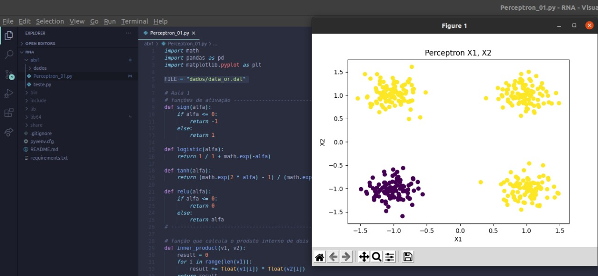
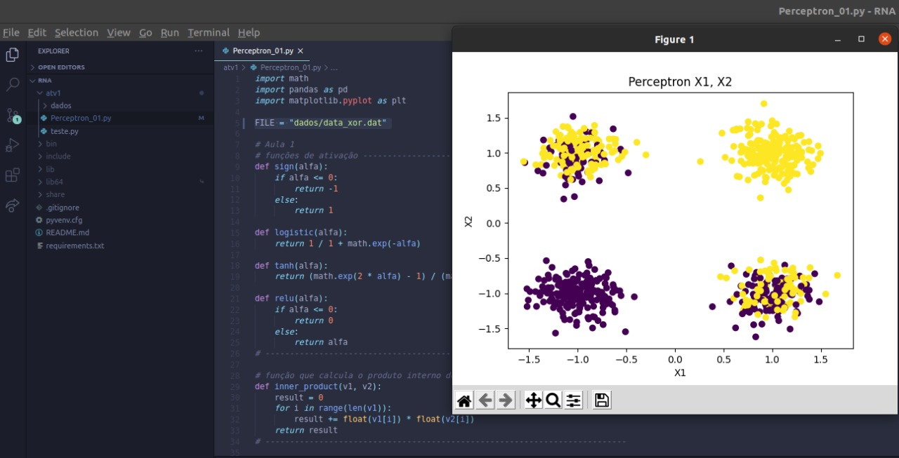

## Perceptron

Considerando o classificador Perceptron discutido na disciplina, realizamos o treinamento do Perceptron e plotamos os dados.

Considerando o algoritmo:

   

data_or:

   

data_xor:

   

