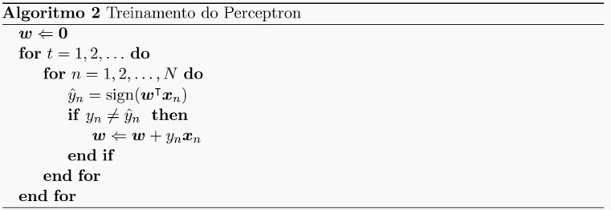
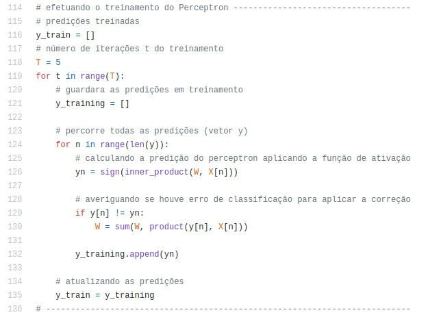
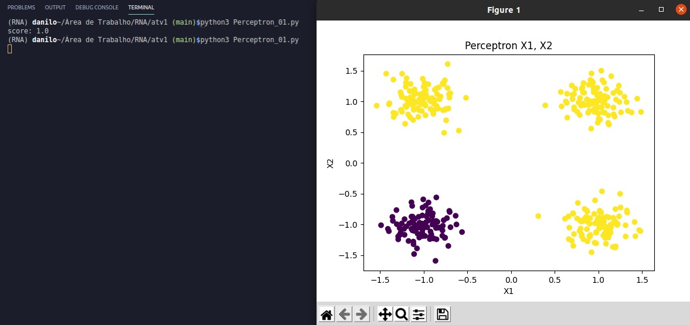
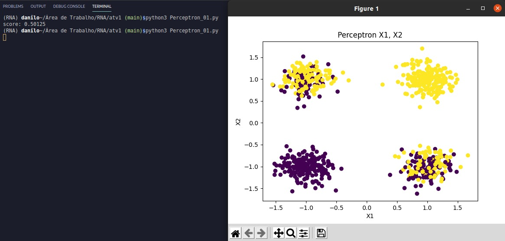

## Perceptron

Perceptron é uma rede neural de camada única e um Perceptron de várias camadas é chamado de Rede Neural Artificial. O Perceptron é um classificador linear (binário). Além disso, é usado na aprendizagem supervisionada e pode ser usado para classificar os dados de entrada fornecidos.

Considerando o classificador Perceptron discutido na disciplina, realizamos o treinamento do Perceptron e plotamos os dados para cada um dos <a href="https://github.com/daniloaldm/RNA/tree/main/atv1/dados">datasets fornecidos</a>, que possuiam amostras de treinamento para problemas de classificação binária com X = R² e Y = {−1, 1}.

Os dados estão na forma de

um arquivo de texto com três colunas:

1. Coluna 1: atributo numérico 1 (x1);
2. Coluna 2: atributo numérico 2 (x2);
3. Coluna 3: classe (y).

## Código
Considerando o algoritmo:

   

Fizemos o algoritmo no código:

   

## Resultados
data_or:

   

data_xor:

   

## :man_technologist: Autores

- **Danilo Alexandrino** - [GitHub](https://github.com/daniloaldm) - Email: [danilo.alexandrinodm@gmail.com](mailto:danilo.alexandrinodm@gmail.com)
- **Antônio Carlos S. F. Júnior** - [GitHub](https://github.com/cacajr) - Email: [espinhado010203@gmail.com](espinhado010203@gmail.com)
